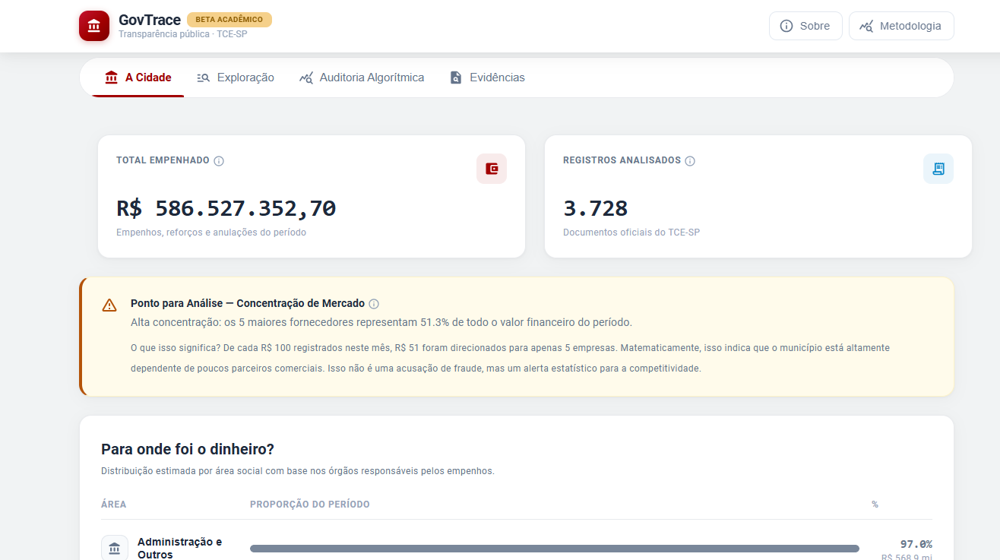
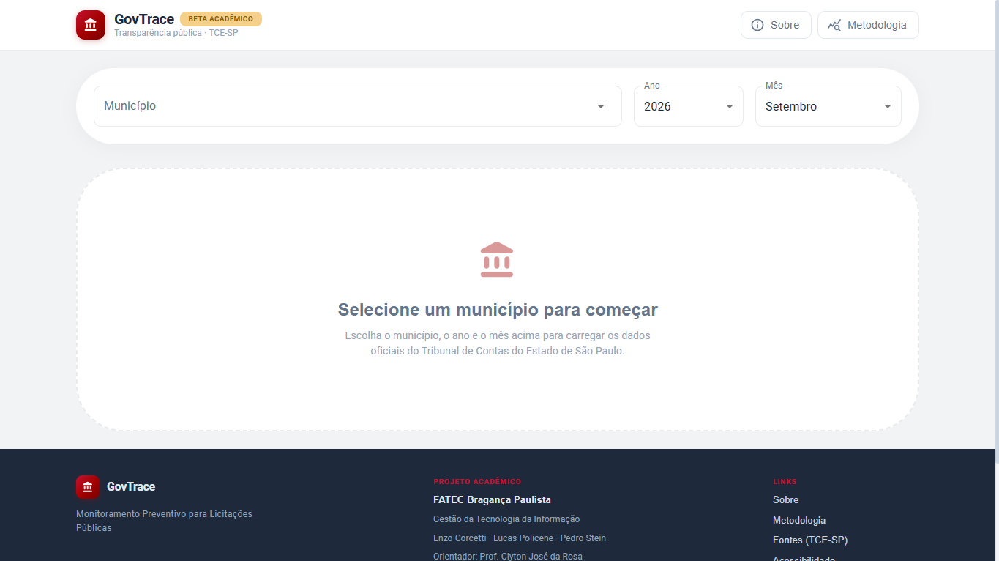
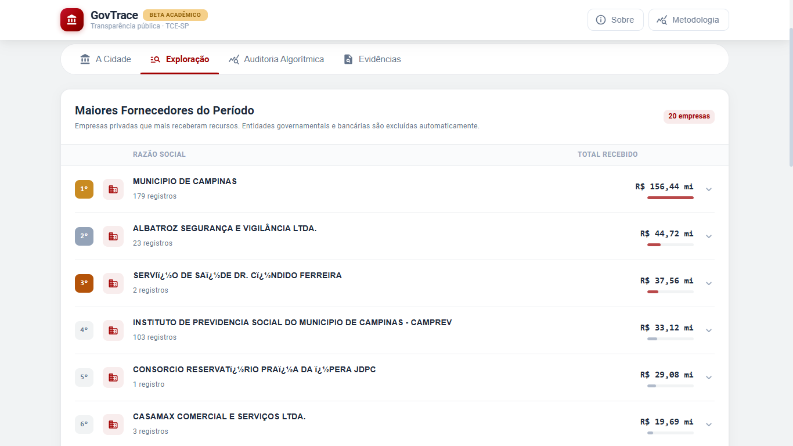
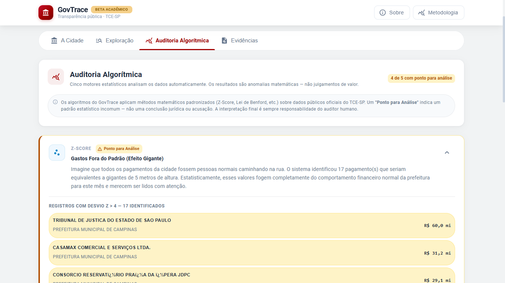
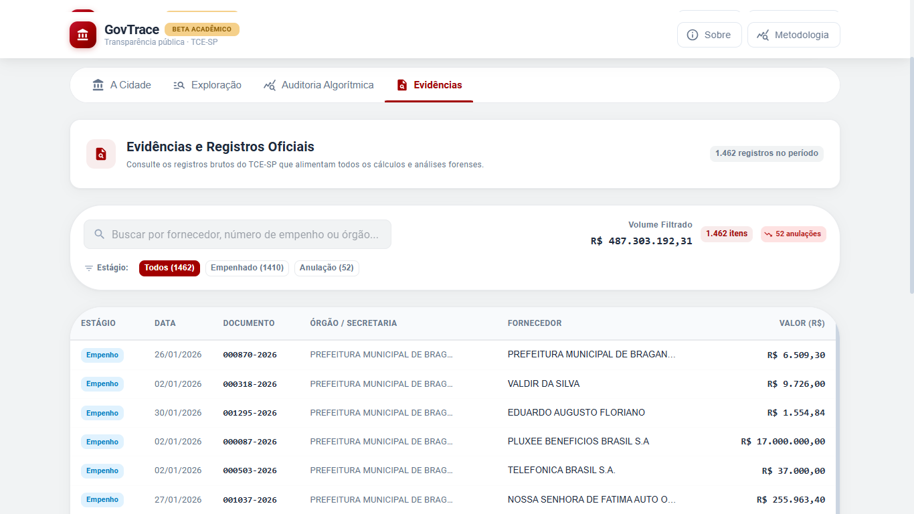
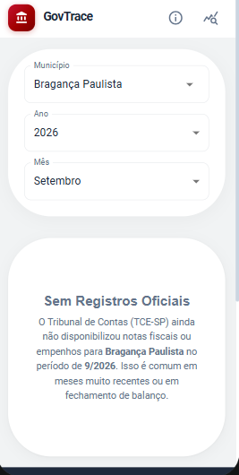
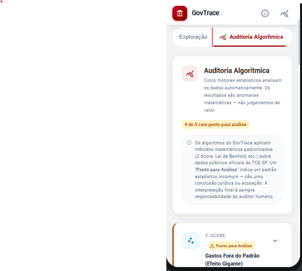
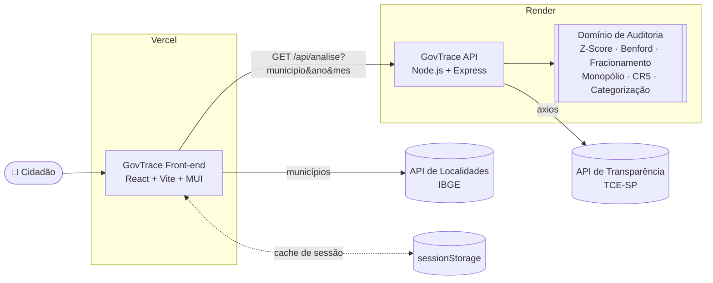

<div align="center">

# 🏛️ GovTrace — Transparência Pública para Todos

**Auditoria contínua e cidadã das despesas públicas municipais de São Paulo, com dados oficiais do TCE-SP.**

[](https://gov-trace.vercel.app)
[](https://github.com/Pedro6Stein/Govtrace-Api)


*Trabalho de Conclusão de Curso — Gestão da Tecnologia da Informação · FATEC Bragança Paulista*

</div>

---



## 📌 Sumário

- [Sobre o projeto](#-sobre-o-projeto)
- [Visão e propósito](#-visão-e-propósito)
- [Funcionalidades](#-funcionalidades)
- [Telas](#-telas)
- [Arquitetura](#-arquitetura)
- [Decisões de engenharia](#-decisões-de-engenharia)
- [Tecnologias](#-tecnologias)
- [Instalação](#-instalação)
- [Estrutura de pastas](#-estrutura-de-pastas)
- [Roadmap](#-roadmap)
- [Como contribuir](#-como-contribuir)
- [Equipe](#-equipe)
- [Licença](#-licença)

---

## 💡 Sobre o projeto

O Tribunal de Contas do Estado de São Paulo (TCE-SP) publica milhares de notas de empenho por município todos os meses. Os dados são públicos, mas chegam em um formato que praticamente só especialistas conseguem interpretar.

O **GovTrace** transforma esse volume de registros em **informação compreensível para qualquer cidadão**. Você escolhe o município e o período, e o sistema:

1. consulta os dados oficiais do TCE-SP (por meio da [GovTrace API](https://github.com/Pedro6Stein/Govtrace-Api));
2. aplica **motores estatísticos de auditoria** (Z-Score, Lei de Benford, Fracionamento, Monopólio e Concentração CR5);
3. apresenta os resultados em uma interface em que **o dado é o protagonista** e a explicação em linguagem cidadã fica a um clique de distância.

> ⚖️ **Princípio de neutralidade:** o GovTrace não acusa ninguém. Os algoritmos apontam **padrões estatísticos incomuns** ("Pontos para Análise"), nunca conclusões jurídicas. A interpretação final é sempre humana.

## 🌱 Visão e propósito

O GovTrace é um **projeto acadêmico em constante evolução**, construído desde o início com **foco em escalabilidade**: front-end e back-end são desacoplados, a lógica de auditoria vive em um domínio isolado e cada camada pode crescer de forma independente.

O código é **aberto** com dois objetivos claros:

- **Inspirar outros desenvolvedores** a usar tecnologia a favor do interesse público, mostrando na prática como transformar dados governamentais em ferramentas cívicas.
- **Engajar a sociedade na fiscalização pública**, colocando nas mãos do cidadão os mesmos métodos estatísticos usados por auditores.

Queremos **crescer rápido**. Por isso estamos estruturando a base para receber **parcerias institucionais e contribuições da comunidade**, como um projeto **Open Source de impacto social**. Se você é dev, designer, estatístico, jornalista de dados ou gestor público, há espaço para você aqui. Veja [Como contribuir](#-como-contribuir).

## ✨ Funcionalidades

| Aba | O que mostra |
|---|---|
| 🏛️ **A Cidade** | Total empenhado, quantidade de registros, concentração de mercado (CR5) e distribuição dos gastos por área social |
| 🔎 **Exploração** | Ranking dos fornecedores que mais receberam recursos, com drill-down nas notas de cada um |
| 📈 **Auditoria Algorítmica** | Resultado dos 5 motores estatísticos, com a métrica principal em destaque e os registros que a sustentam |
| 📄 **Evidências** | Tabela com todos os registros oficiais do período, com busca e filtro por estágio contábil (empenho, liquidação, pagamento, reforço, anulação) |

Além disso:

- **Seleção de qualquer um dos 645 municípios paulistas**, com lista carregada dinamicamente da API do IBGE.
- **Explicação cidadã sob demanda**: cada indicador tem um "Entenda este dado" que revela, em linguagem simples, o que o número significa e qual método o gerou.
- **Modal de Metodologia** documentando os critérios científicos de cada motor.

## 🖼️ Telas

### Tela inicial: seleção de município e período


### A Cidade: visão macro do período


### Exploração: ranking de fornecedores


### Auditoria Algorítmica: motores estatísticos


### Explicação cidadã: divulgação progressiva


### Evidências: registros oficiais rastreáveis


### Experiência mobile
<p align="center">
  
  &nbsp;&nbsp;
  
</p>

## 🧱 Arquitetura

O GovTrace segue uma **arquitetura desacoplada**. Este repositório é a **camada de apresentação**: não faz nenhum cálculo, apenas consome a análise pronta da API e a exibe.



**Por que desacoplar?** Na primeira versão (monólito front-end), o navegador do cidadão baixava milhares de registros brutos e executava toda a estatística localmente. Ao mover a lógica para o back-end:

- o front ficou **mais leve e mais rápido**, com cerca de 600 linhas de lógica removidas do cliente;
- as regras de auditoria passaram a ter **uma única fonte da verdade**, testável isoladamente;
- a mesma API pode alimentar no futuro **outros clientes** (app mobile, bots, dados abertos para jornalistas).

## 🛠️ Decisões de engenharia

### ⚡ Cache de sessão resiliente (`sessionStorage`)

Cada análise consolidada (município + ano + mês) é guardada no `sessionStorage` do navegador. Voltar a um período já consultado é **instantâneo** e não gera nenhuma nova chamada à API.

A implementação foi pensada para **nunca derrubar a experiência**:

- **Tolerante a cota cheia:** cada análise ocupa cerca de 1 MB, e o `sessionStorage` tem limite de aproximadamente 5 MB. Leitura e escrita ficam protegidas por `try/catch`; se o cache estiver cheio ou corrompido, a consulta segue normalmente pela rede.
- **Escopo de sessão:** o cache expira sozinho ao fechar a aba, então o cidadão sempre recebe dados atualizados em uma nova visita.
- **Chave determinística:** `govtrace_analise_{municipio}_{ano}_{mes}`.

### 🏁 Proteção contra *race conditions*

Se o usuário troca de filtro enquanto uma consulta ainda está em andamento, a requisição anterior é **cancelada com `AbortController`**. Isso impede que uma resposta antiga, que chegou atrasada, sobrescreva os dados do período atual.

### 📱 Design responsivo e acessível

- **Mobile-first com CSS Grid** e breakpoints do MUI (`xs`, `sm`, `md`): cards em coluna única no celular e em grade no desktop, com números longos protegidos contra overflow.
- **Divulgação progressiva:** o componente `ExplicacaoCidada` centraliza o padrão "botão + Collapse". O número aparece primeiro e a explicação vem quando o usuário pede.
- **Acessibilidade (ARIA):** os botões de expansão expõem `aria-expanded` e `aria-controls`. Tooltips, que não funcionam bem com toque nem com teclado, foram substituídos por conteúdo expansível.
- **Design system tonal** com a paleta institucional da FATEC, definido em um tema MUI único (`src/tema/tema.js`).

## 🧰 Tecnologias

| Categoria | Tecnologia |
|---|---|
| UI | [React 19](https://react.dev/) |
| Build / Dev server | [Vite 6](https://vite.dev/) |
| Componentes e tema | [Material UI 6](https://mui.com/) + [Emotion](https://emotion.sh/) |
| Dados | [GovTrace API](https://github.com/Pedro6Stein/Govtrace-Api) · [API de Localidades do IBGE](https://servicodados.ibge.gov.br/api/docs/localidades) |
| Qualidade | ESLint 9 (react-hooks, react-refresh) |
| Deploy | [Vercel](https://vercel.com/) |

## 🚀 Instalação

### Pré-requisitos

- [Node.js](https://nodejs.org/) **20+**
- npm 10+

### Passo a passo

```bash
# 1. Clone o repositório
git clone https://github.com/Pedro6Stein/GovTrace.git
cd GovTrace

# 2. Instale as dependências
npm install

# 3. Rode em modo de desenvolvimento
npm run dev
```

Acesse **http://localhost:5173**.

### Variáveis de ambiente

| Variável | Descrição | Padrão |
|---|---|---|
| `VITE_API_URL` | Endpoint de análise da GovTrace API | `https://govtrace-api.onrender.com/api/analise` |

Sem nenhuma configuração, o front usa a API de produção. Para desenvolver com a [API rodando localmente](https://github.com/Pedro6Stein/Govtrace-Api#-instalação), crie um arquivo `.env.local`:

```env
VITE_API_URL=http://localhost:3333/api/analise
```

> ℹ️ Variáveis `VITE_*` são embutidas no bundle **no momento do build**. Na Vercel, faça um *redeploy* depois de alterá-las.

> ⏳ A API de produção roda no plano gratuito do Render e hiberna quando fica ociosa. A **primeira** consulta depois de um período parado pode levar cerca de 50 s (*cold start*).

### Scripts

| Comando | Descrição |
|---|---|
| `npm run dev` | Servidor de desenvolvimento com HMR |
| `npm run build` | Build de produção em `dist/` |
| `npm run preview` | Serve o build localmente |
| `npm run lint` | Análise estática com ESLint |

## 📁 Estrutura de pastas

```
src/
├── componentes/
│   ├── abaCidade/          # HeroCidade, GraficoDestino
│   ├── abaExploracao/      # RankingFornecedores, DrawerEvidencias
│   ├── abaAuditoria/       # PainelAuditoria, CardAlerta
│   ├── abaEvidencias/      # TabelaEvidenciasAvancada
│   ├── ExplicacaoCidada/   # Padrão reutilizável de divulgação progressiva
│   ├── SeletorPeriodo/     # Município (IBGE) + ano + mês
│   ├── ModalMetodologia/   # Documentação científica dos motores
│   └── ...                 # Cabecalho, Rodape, Sobre, SkeletonPainel
├── paginas/Painel/         # Orquestra filtros, estado e as 4 abas
├── servicos/
│   ├── apiGovtrace.js      # Cliente da GovTrace API + cache de sessão
│   └── ibge.js             # Lista de municípios de SP
├── dados/configuracoes.js  # Configurações exclusivas de UI (anos/meses)
└── tema/tema.js            # Design system (paleta, tipografia, overrides MUI)
```

## 🗺️ Roadmap

- [x] Painel cidadão com 4 abas progressivas
- [x] Motores estatísticos de auditoria
- [x] Arquitetura desacoplada (Front React + API Node.js)
- [x] Cache de sessão e cancelamento de requisições
- [ ] Série histórica: comparação entre meses e anos
- [ ] Code-splitting por aba para reduzir o bundle inicial
- [ ] Exportação de relatórios (PDF/CSV)
- [ ] Compartilhamento de análises por link (filtros na URL)
- [ ] Testes automatizados de componentes
- [ ] Modo escuro e auditoria de acessibilidade (WCAG 2.1 AA)

## 🤝 Como contribuir

Contribuições são **muito bem-vindas**, sejam de código, design, documentação, estatística ou ideias.

1. Faça um **fork** do projeto.
2. Crie uma branch descritiva: `git checkout -b feat/comparativo-mensal`
3. Faça commits seguindo o padrão **[Conventional Commits](https://www.conventionalcommits.org/pt-br/)**:
   - `feat:` nova funcionalidade · `fix:` correção · `refactor:` refatoração · `docs:` documentação · `chore:` manutenção
4. Garanta que `npm run lint` e `npm run build` passem.
5. Abra um **Pull Request** explicando o **porquê** da mudança, com prints se ela alterar a interface.

**Diretrizes do projeto:**

- 🗣️ **Linguagem neutra e não acusatória** em qualquer texto exibido ao cidadão.
- 🧮 **Nenhuma lógica de cálculo no front-end.** Regras de negócio pertencem à [GovTrace API](https://github.com/Pedro6Stein/Govtrace-Api).
- ♿ **Acessibilidade e mobile** não são opcionais: teste em telas pequenas e com teclado.

Encontrou um bug ou tem uma ideia? Abra uma [issue](https://github.com/Pedro6Stein/GovTrace/issues).

Tem interesse em uma **parceria institucional** (universidades, ONGs, observatórios sociais, órgãos de controle)? Entre em contato com a equipe.

## 👥 Equipe

| Integrante | Papel |
|---|---|
| **Pedro Stein** | Líder Técnico · Desenvolvedor Full-Stack |
| **Enzo Corcetti** | Desenvolvedor |
| **Lucas Policene** | Desenvolvedor |

**Orientador:** Prof. Clyton José da Rosa
**Instituição:** FATEC Bragança Paulista, curso de Gestão da Tecnologia da Informação

## 📄 Licença

Distribuído sob a licença **MIT**. Veja o arquivo [`LICENSE`](./LICENSE) para mais detalhes.

Os dados exibidos são públicos e pertencem ao **Tribunal de Contas do Estado de São Paulo (TCE-SP)**. A lista de municípios é fornecida pelo **IBGE**.

---

<div align="center">

Feito com 🧡 por estudantes da FATEC Bragança Paulista, para que **todo cidadão possa fiscalizar o dinheiro público**.

</div>
